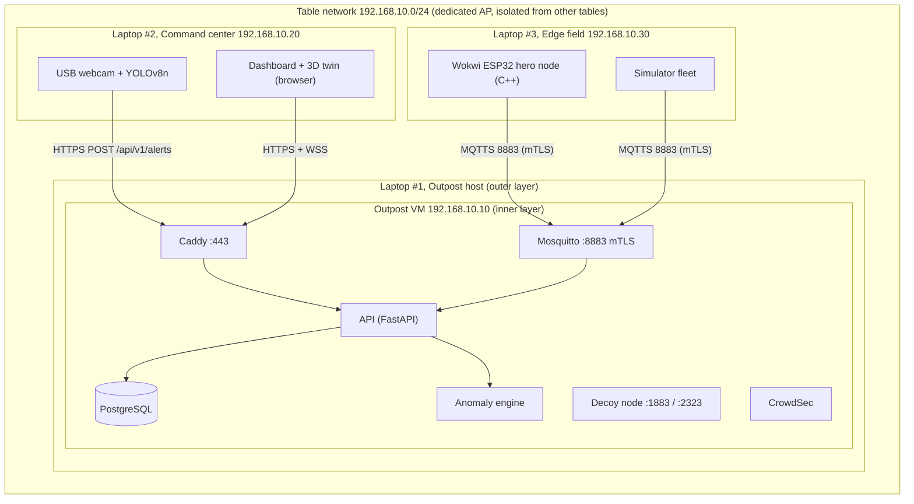
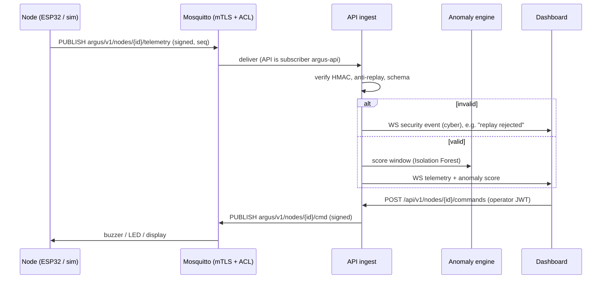

# Project ARGUS: Sentinel-X Virtual Twin Architecture

> EPSI Workshop BAC+4 2026, Mission Sentinel-X. Variant presented: **Option C, "Virtual Twin"**
> (approved by our mentor in place of the physical ESP8266 case).
> Status: v0.1, for coach validation on Monday.

## 1. Summary

ARGUS supervises a **fleet of virtual Sentinel-X nodes** on an AetherCorp outpost. It merges the three
threats from the brief into one timeline:

| Threat (brief §1) | Detected by |
|---|---|
| Environmental (gas leak, overheating) | Node sensors (DHT22, MQ-2) + Isolation Forest anomaly model |
| Physical intrusion | Node PIR + **real USB webcam** with YOLOv8n + correlation engine |
| Cyberattack | Broker/API security events, CrowdSec, traffic anomaly model, decoy node |

Nodes are either **real C++ firmware on an emulated ESP32** (Wokwi, the "hero" node) or
**containerised simulators** (the fleet). Both speak the same protocol, so the server can't tell
them apart. The same firmware binary can be flashed onto a real ESP32.

### Mapping to the brief's options
- Option A (Raspberry Pi 5) and Option B (student laptop as server) become **Option C**: a student
  laptop hosts a hardened **Linux VM ("Outpost")** that runs the full Docker-Compose stack. The USB
  webcam stays physical.
- ESP8266 becomes **ESP32** (Wokwi does not emulate the ESP8266. The ESP32 also has hardware AES/SHA/ECC for TLS).

## 2. Physical & network topology



### 2.1 IP addressing plan

| Segment | Range | Hosts |
|---|---|---|
| Table LAN (Wi-Fi AP) | `192.168.10.0/24` | `.1` AP/gateway, `.10` Outpost VM (bridged), `.20` command center, `.30` edge laptop, `.100–.150` DHCP for the jury/guests |
| Docker `edge_net` | `172.20.10.0/24` | mosquitto, decoy (the only nets with published ports) |
| Docker `core_net` (internal) | `172.20.20.0/24` | api, postgres, mosquitto, anomaly engine (**no route outside**) |
| Docker `ops_net` | `172.20.30.0/24` | caddy, api, grafana, prometheus |
| Wokwi virtual Wi-Fi | `10.13.37.0/24` | the hero node (`10.13.37.2`), NAT through the Wokwi gateway on laptop #3 |

Isolation between tables: our AP uses its own SSID with WPA2-PSK and client isolation for guests. The Outpost VM firewall
only accepts the ports in §5.1.

### 2.2 Fallback (single laptop)
If only laptop #1 is available, everything runs on it. The webcam script and Wokwi run on the host, and
the VM is reached on a host-only network. The architecture stays the same, only the IPs change.

## 3. Data flows



### 3.1 MQTT topics

| Topic | Direction | QoS | Retained | Content |
|---|---|---|---|---|
| `argus/v1/nodes/{id}/telemetry` | node to server | 1 | no | periodic sensor readings (every 2 s) |
| `argus/v1/nodes/{id}/events` | node to server | 1 | no | discrete events: `pir`, `boot`, `tamper`, `ack` |
| `argus/v1/nodes/{id}/status` | node to server | 1 | **yes** | `online` / `offline` (Last Will) |
| `argus/v1/nodes/{id}/cmd` | server to node | 1 | no | `buzzer`, `led`, `display` |

`{id}` **is** the Common Name of the node's client certificate. Mosquitto enforces this
(`use_identity_as_username` + `pattern` ACLs), so a node can never publish as another node.

### 3.2 Message envelope (signed)

Payload = `<body>` + `\n` + `<signature>`, where the signature is computed over the **exact bytes** of the body:

```json
{"v":1,"node":"sentinel-01","seq":1759700000123,"ts":1759700000,"type":"telemetry",
 "data":{"temp_c":24.1,"hum_pct":41.0,"gas_ppm":180,"pir":false}}
```
```
signature = hex( HMAC-SHA256( device_key, body_bytes ) )
```

- `seq` is strictly increasing (unix milliseconds). The server rejects `seq <= last_seq[node]` (**anti-replay**).
- The server rejects messages with `|ts - now| > 30 s` (**freshness**).
- `device_key` is 32 random bytes issued per node with its certificate. It is never committed to Git.
- Commands (`cmd`) are signed the same way with the node's key, so a node ignores forged commands.

Why both mTLS **and** HMAC? mTLS protects each hop (node to broker, broker to API). The HMAC protects
end to end **through** the broker, so a compromised broker can't forge or alter telemetry (defense in depth).

### 3.3 REST / WebSocket API (served at `https://outpost/api/v1`)

| Method | Path | Auth | Purpose |
|---|---|---|---|
| POST | `/auth/login` | none, rate limited | get a JWT (`viewer` / `operator`) |
| POST | `/alerts` | service token | **required by the brief**: external alerts (vision script, correlation) |
| GET | `/nodes` | viewer | fleet with status and last values |
| GET | `/telemetry?node=&minutes=` | viewer | history for charts |
| GET | `/events?category=&limit=` | viewer | unified timeline (environmental / intrusion / cyber) |
| POST | `/nodes/{id}/commands` | **operator** | actuators: buzzer, led, display |
| WS | `/ws?token=` | viewer | live push: telemetry, events, anomaly scores |

## 4. AI components

| Component | Runs on | Input | Model | Output |
|---|---|---|---|---|
| Vision | Laptop #2 (host, real webcam) | USB webcam, resized to 640×480 | YOLOv8n (person class), or the OpenCV HOG fallback (about 35 ms per frame), restricted-zone polygon, **face blur before anything is shown** | `POST /alerts` (intrusion), annotated MJPEG stream on localhost |
| Sensor anomaly | Outpost (api container) | sliding window per node: values + rates of change + temp×gas correlation | **Isolation Forest** (scikit-learn), trained on normal simulated data | anomaly score 0–1, "pre-alarm" before thresholds |
| Traffic anomaly | Outpost | per-node 10 s buckets: msg count, mean payload size, rejected messages, message types (log scale) | **EllipticEnvelope** (robust Mahalanobis). Isolation Forest was tried first and failed: it can't extrapolate, so a 400-message flood landed in the same leaf as a normal 7-message bucket | cyber event (DoS / injection suspicion). Boot bursts are excluded |
| Correlation engine | Outpost | events from all sources within 30 s | weighted rules over model outputs | escalated incident (e.g. PIR + camera + gas = critical) |

There is no static `if temp > 40` rule (forbidden by the brief). Thresholds only exist as **ground-truth labels** for evaluating the models.

Measured with `ai/anomaly/train.py` (models trained only on normal operation):

| Scenario | Model detects after | Naive threshold after |
|---|---|---|
| Gas leak | 4 s | 58 s |
| Slow overheat + gas micro-deviation | 32 s | 278 s |
| Stuck / erratic sensor | 2 s | 212 s |

The false-positive rate is 0.34 % (sensors) and 0 % (traffic).

## 5. Security: defense in depth

| Layer | Control | Proof for the jury |
|---|---|---|
| 1. Host (laptop #1) | Windows firewall, VM-only exposure, disk encryption | firewall rules screenshot |
| 2. VM OS | UFW deny-by-default, SSH **keys only** from the admin IP, unattended upgrades, no root login | `ufw status`, `sshd -T`, nmap from another laptop |
| 3. Containers | non-root users, `read_only`, `cap_drop: ALL`, `no-new-privileges`, resource limits, internal `core_net` | `docker inspect`, compose file |
| 4. Transport | MQTTS 8883 with **mTLS** (private CA, one cert per node), HTTPS 443 (TLS 1.2+) | Wireshark: encrypted only. A cert-less client is refused |
| 5. Message | per-node ACL (`%u` = cert CN), HMAC signature, anti-replay, schema validation | live replay/forgery attempt is rejected and shown on the dashboard |
| 6. Application | JWT with roles, rate limiting, secrets via Docker secrets / `.env` (gitignored) | operator vs viewer demo |
| 7. Detection | CrowdSec (auto-ban), security events as a sensor, traffic anomaly model, **decoy node**, Mosquitto log watcher | live cyber timeline during the pentest. `tools/redteam/attacks.py` checks each one |

### 5.1 Exposed surface on the Outpost VM

| Port | Service | Who |
|---|---|---|
| 443/tcp | Caddy (dashboard + API) | table LAN |
| 8883/tcp | Mosquitto mTLS | table LAN |
| 1883/tcp, 2323/tcp | **Decoy** (fake plaintext broker, fake telnet console) | anyone, every hit is logged |
| 22/tcp | SSH (keys only) | admin IP `192.168.10.20` only |

Everything else is dropped.

### 5.2 PKI
- Private CA (EC P-256), kept offline on the admin laptop (`infra/pki/out/`, gitignored).
- Certificates: `mosquitto` (server, SANs = VM IP and hostname), `outpost` (Caddy), `argus-api` (MQTT client),
  `sentinel-NN` (one per node, client).
- Revocation: CRL loaded by Mosquitto (`crlfile`). Demo: revoke a node and it gets disconnected.
- Issued with `infra/pki/pki.sh` (OpenSSL). step-ca is a later upgrade if time allows.

### 5.3 Threat model (STRIDE summary)

| Threat | Example (pentest day) | Mitigation |
|---|---|---|
| Spoofing | fake node publishes fake gas readings | mTLS + CN-bound ACL + HMAC |
| Tampering | MitM alters telemetry | TLS + HMAC |
| Repudiation | "who triggered the buzzer?" | commands logged with JWT subject |
| Information disclosure | sniffing the Wi-Fi | TLS everywhere, no plaintext service except the decoy |
| Denial of service | MQTT flood, SYN flood on 443 | Mosquitto limits, Caddy rate limits, CrowdSec ban, container resource limits |
| Elevation of privilege | container escape, SSH brute force | non-root/read-only containers, SSH keys only, UFW |

## 6. Repository layout

```
docs/            architecture, security matrix, audit report
infra/           docker-compose, mosquitto, caddy, pki, hardening scripts
services/api     FastAPI: ingest, REST, WebSocket, security events
services/simulator  virtual node fleet + scenario director
services/decoy   honeypot
services/common  shared protocol (envelope, signing)
ai/vision        webcam + YOLOv8n
ai/anomaly       Isolation Forest models (sensor + traffic)
firmware/sentinel-node  ESP32 C++ (PlatformIO + Wokwi)
dashboard/       React + Three.js digital twin
```

## 7. Team ownership

| Member | Track | Owns |
|---|---|---|
| 1 | INFRA | VM, compose, network plan, hardening, Caddy, monitoring |
| 2 | INFRA / security | PKI, Mosquitto mTLS/ACL, CrowdSec, decoy, self-pentest and audit report |
| 3 | DEV | API, protocol, firmware, simulator, scenario director |
| 4 | DEV | dashboard, 3D twin, actuator panel, cyber timeline |
| 5 | IA | vision, anomaly models, correlation engine |
